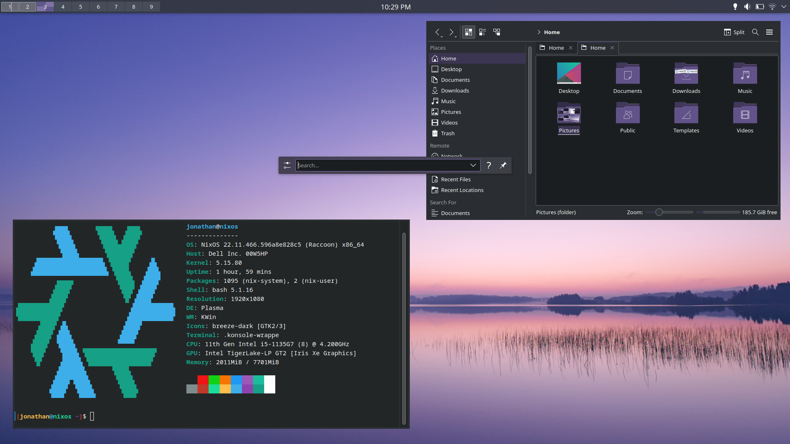

# KDE Plasma Config

Since KDE Plasma customizations are unfortunately difficult to track with dotfiles, it will have to suffice for me to document my customizations.

I try to keep tinkering/ricing to a minimum and focus on actual work.  However, I find that a keyboard-driven tiling setup gives me productivity gains over a traditional floating desktop.  Unfortunately, I find the existing standalone window managers I've tried to be too bare-bones, missing basic functionality such as mounting drives, switching displays, power management, and many other things that I don't want to maintain myself.

KDE Plasma with Bismuth gives me an excellent tiling experience within a featureful environment that lets me focus on my work.  The one major drawback is that it's difficult to track my elaborate configuration in version control, as Plasma configuration files are not static.

If you have any ideas on how I can better track my Plasma configuration in version control, please contact me.  In the future, I hope that either the KDE devs will create a better text-based configuration interface or that someone will come up with a "tiling desktop environment" with sane defaults.

## System Settings

### Appearance

* **Global Theme**: Breeze Dark
* **Application Style**: Breeze
* **Plasma Style**: Breeze (Follows Color Scheme)
* **Colors**: Use accent color from current wallpaper
* **Window Decorations**: Bismuth
* **Fonts**: 
  * **Fixed width**: Noto Sans Mono 11pt
* **Icons**: Breeze Dark
* **Cursors**: Breeze

### Workspace Behavior

#### General Behavior

* **Clicking files or folders**: Selects them (open by double-clicking instead)

#### Virtual Desktops

* Create 9 virtual desktops in Row 1
* **Show animation when switching**: None

#### Activities

* None (I don't use Activities)

### Window Management

#### Task Switcher

* **Thumbnails**

#### Window Tiling

* **Enable window tiling**: true
* **Separate layouts for each**:
  * **Activity**: true
  * **Virtual Desktop**: true

* **Maximize sole window**: false
* **Untile windows by dragging**: false
* **Floating windows always on top**: true
* **Spawn windows at**: The layout's end

* **Prevent window minimization**: true
* **Prevent window from protruding from its screen**: true

* Outer/inner gaps: none

### Shortcuts:

* Import `shortcuts.kksrc` (essentially the cornerstone of this setup)
* Set a custom shortcut, **Ctrl+Enter**, to launch `konsole`

### Search:

#### Plasma Search

* Configure KRunner and set **Position on screen** to Center

## Spectacle

### Rectangular Region Selection

* **Accept on click-and-release**: true
* **Show capture instructions**: false

## Konsole

* **Settings > Toolbars Shown**: hide all toolbars
* **Show Menubar**: false

## Panel

* **Panel height**: 32
* Move panel to top of screen
* Arrange panel in the following order from left to right:
  * Pager
  * Spacer
  * Digital Clock
  * Spacer
  * System Tray

### Digital Clock 

* **Show seconds**: false

### Pager

* **Text display**: Desktop number
